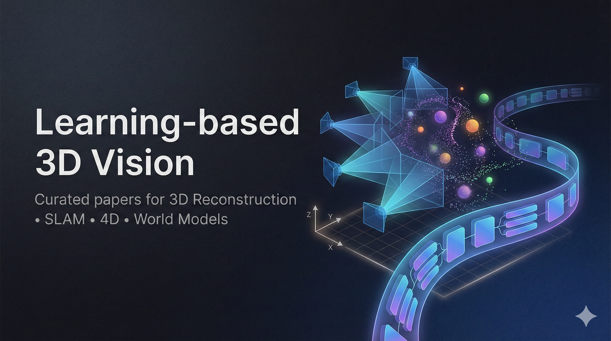

<div align="center">

# Learning-based 3D Vision

[](https://github.com/dongjiacheng06/Learning-based-3D-Vision/stargazers)
[](./LICENSE)
[](./CONTRIBUTING.md)

A curated collection of works in **Learning-based 3D Vision**, systematically organizing nearly ten major branches of 3D/4D vision research, include but not limited to E2E 3D Reconstruction/4DV/Online Reconstruction and other several frontier fields. This repository was created to help researchers quickly locate papers relevant to their field and enable newcomers to build a clear understanding of the landscape. It aims to serve as a comprehensive resource for scholars, practitioners, and enthusiasts exploring 3D vision and its exciting applications in embodied intelligence, world perception, and beyond. 
<p align="center">
  
</p>

*Photo Credit: [Gemini-Nano-Banana🍌](https://aistudio.google.com/models/gemini-2-5-flash-image)*.
</div>

---

## News & Updates
Major updates and announcements are shown below. Scroll for full taxonomy and paper lists.

- [2026.09] Added 8 curated papers through 2026-09-04 covering streaming reconstruction, geometric pre-training, world-action models, generative reconstruction, and multi-view 3D tracking benchmarks.
- [2026.08] Added 43 curated papers through 2026-08-19 and expanded the taxonomy for 3D vision-language models, spatial intelligence, and standalone datasets/benchmarks.
- [2026.05] Added recent 3D/4D reconstruction, generation, perception, and world-model papers through 2026-05-03.
- [2026.01] Repo Launch — Learning-based-3D-Vision is now live! See [CONTRIBUTING.md](./CONTRIBUTING.md) for how to contribute.
- [Ongoing] Community Contributions Welcome — Submit papers via PR or open an issue.
- ⭐ [Ongoing] If you find this useful, please consider giving a star and sharing it with your research community!

---

## Categories


<ul style="list-style: none; padding: 0;">
<li style="margin-left: 0;"><a href="#surveys">Surveys</a></li>
<li style="margin-left: 0;">
<details>
<summary><a href="#end-to-end-3d-reconstruction">End to End 3D Reconstruction</a></summary>
<ul>
<li><a href="#non-pixel-aligned">non-pixel aligned</a></li>
<li><a href="#other-e2e-3d-reconstruction">other E2E 3D Reconstruction</a></li>
</ul>
</details>
</li>
<li style="margin-left: 0;">
<details>
<summary><a href="#online-3rslam">Online 3R/SLAM</a></summary>
<ul>
<li><a href="#online-3r">Online 3R</a></li>
<li><a href="#slam">SLAM</a></li>
</ul>
</details>
</li>
<li style="margin-left: 0;"><a href="#3d-generation">3D Generation</a></li>
<li style="margin-left: 0;"><a href="#4d-generation">4D Generation</a></li>
<li style="margin-left: 0;"><a href="#3d-editing">3D Editing</a></li>
<li style="margin-left: 0;">
<details>
<summary><a href="#3d-perception">3D Perception</a></summary>
<ul>
<li><a href="#depth--geometry-perception">Depth / Geometry Perception</a></li>
<li><a href="#3d-understanding">3D Understanding</a></li>
</ul>
</details>
</li>
<li style="margin-left: 0;">
<details>
<summary><a href="#3d-vision-language--spatial-intelligence">3D Vision-Language / Spatial Intelligence</a></summary>
<ul>
<li><a href="#3d-aware-vision-language-models">3D-Aware Vision-Language Models</a></li>
<li><a href="#spatial-reasoning--memory">Spatial Reasoning / Memory</a></li>
</ul>
</details>
</li>
<li style="margin-left: 0;">
<details>
<summary><a href="#4d-reconstruction">4D Reconstruction</a></summary>
<ul>
<li><a href="#e2e-4d-reconstruction">E2E 4D Reconstruction</a></li>
<li><a href="#non-e2e-4d-reconstruction">non-E2E 4D Reconstruction</a></li>
</ul>
</details>
</li>
<li style="margin-left: 0;"><a href="#4d-editing">4D Editing</a></li>
<li style="margin-left: 0;">
<details>
<summary><a href="#4d-perception">4D Perception</a></summary>
<ul>
<li><a href="#4d-geometry--motion-perception">4D Geometry / Motion Perception</a></li>
<li><a href="#4d-understanding--tracking">4D Understanding / Tracking</a></li>
</ul>
</details>
</li>
<li style="margin-left: 0;"><a href="#explicit-3d-free-methods">Explicit 3D-Free Methods</a></li>
<li style="margin-left: 0;"><a href="#related-analysis">Related Analysis</a></li>
<li style="margin-left: 0;">
<details>
<summary><a href="#foundation-models-with-3d-awareness">Foundation Models with 3D Awareness</a></summary>
<ul>
<li><a href="#generative-models">Generative Models</a></li>
<li><a href="#world-models--action-models">World Models / Action Models</a></li>
</ul>
</details>
</li>
<li style="margin-left: 0;"><a href="#datasets--benchmarks">Datasets / Benchmarks</a></li>
<li style="margin-left: 0;">
<details>
<summary><a href="#3d-vision-applications">3D Vision Applications</a></summary>
<ul>
<li><a href="#autonomous-driving">Autonomous Driving</a></li>
</ul>
</details>
</li>
<li style="margin-left: 0;"><a href="#acknowledgements">Acknowledgements</a></li>
<li style="margin-left: 0;"><a href="#citation">Citation</a></li>
</ul>

> **Legend**<br>
> ⭐️ Recommended<br>
> **Last Updated:** 2026-09-04

# 3D Vision Methods
## Surveys
- "Advances in Neural 3D Mesh Texturing: A Survey". [](https://arxiv.org/abs/2606.00137) [](https://sairajk.github.io/neural-mesh-texturing/)
- "3D Generation for Embodied AI and Robotic Simulation: A Survey". [](https://arxiv.org/abs/2604.26509) [](https://3dgen4robot.github.io)
- "Advances in Global Solvers for 3D Vision". [](https://arxiv.org/abs/2602.14662) [](https://github.com/ericzzj1989/Awesome-Global-Solvers-for-3D-Vision)
- "Advances in Feed-Forward 3D Reconstruction and View Synthesis: A Survey". [](https://arxiv.org/abs/2507.14501)
- "3D Scene Generation: A Survey". [](https://arxiv.org/abs/2505.05474v1)
- "Recent Advances in 3D Object and Scene Generation: A Survey". [](https://arxiv.org/abs/2504.11734)
- "Learning-based 3D Reconstruction in Autonomous Driving: A Comprehensive Survey". [](https://arxiv.org/abs/2503.14537)
- "A Review of 3D Reconstruction Techniques for Deformable Tissues in Robotic Surgery". [](https://arxiv.org/abs/2408.04426)


## End to End 3D Reconstruction
### non-pixel aligned
- **GlobalSplat**, "GlobalSplat: Efficient Feed-Forward 3D Gaussian Splatting via Global Scene Tokens". [](https://arxiv.org/abs/2604.15284) [](https://r-itk.github.io/globalsplat/)
- [⭐️] **NOVA3R**, "NOVA3R: Non-pixel-aligned Visual Transformer for Amodal 3D Reconstruction". [](https://arxiv.org/abs/2603.04179) [](https://wrchen530.github.io/nova3r/)

### other E2E 3D Reconstruction
- **Gekko**, "Revisiting Cross-View Completion: Self-Supervised Pre-Training via Reconstruction Error Comparison". [](https://arxiv.org/abs/2609.01530) [](https://thibautloiseau.github.io/projects/gekko/) [](https://github.com/thibautloiseau/gekko)
- **ReconSplat**, "ReconSplat: Generalizable 3D Scene Reconstruction Beyond Observed Views". [](https://arxiv.org/abs/2608.28895) [](https://visinf.github.io/reconsplat/)
- **Argus**, "Argus: Metric Panoramic 3D Reconstruction for Indoor Scenes". [](https://arxiv.org/abs/2606.30047) [](https://argus-paper.realsee.ai/)
- [⭐️] **Déjà View**, "Déjà View: Looping Transformers for Multi-View 3D Reconstruction". [](https://arxiv.org/abs/2605.30215) [](https://research.nvidia.com/labs/dvl/projects/dvlt)
- **R³**, "R³: 3D Reconstruction via Relative Regression". [](https://arxiv.org/abs/2605.26519) [](https://kevinxu02.github.io/r3-site)
- **GenWildSplat**, "Generalizable Sparse-View 3D Reconstruction from Unconstrained Images". [](https://arxiv.org/abs/2604.28193) [](https://genwildsplat.github.io/)
- **RecGen**, "Reconstruction by Generation: 3D Multi-Object Scene Reconstruction from Sparse Observations". [](https://arxiv.org/abs/2604.27106) [](https://reconstruction-by-generation.github.io)
- **WildSplatter**, "WildSplatter: Feed-forward 3D Gaussian Splatting with Appearance Control from Unconstrained Images". [](https://arxiv.org/abs/2604.21182) [](https://github.com/yfujimura/WildSplatter)
- **AnyRecon**, "AnyRecon: Arbitrary-View 3D Reconstruction with Video Diffusion Model". [](https://arxiv.org/abs/2604.19747) [](https://yutian10.github.io/AnyRecon/)
- **VGG-T^3**, "VGG-T^3: Offline Feed-Forward 3D Reconstruction at Scale". [](https://arxiv.org/abs/2602.23361) [](https://research.nvidia.com/labs/dvl/projects/vgg-ttt/)
- [⭐️] **tttLRM**, "tttLRM: Test-Time Training for Long Context and Autoregressive 3D Reconstruction". [](https://arxiv.org/abs/2602.20160) [](https://github.com/cwchenwang/tttLRM)
- [⭐️] **E-RayZer**, "E-RayZer: Self-supervised 3D Reconstruction as Spatial Visual Pre-training". [](https://arxiv.org/abs/2512.10950) [](https://github.com/hwjiang1510/E-RayZer)
- [⭐️] **DA3**, "Depth Anything 3: Recovering the Visual Space from Any Views". [](https://arxiv.org/abs/2511.10647) [](https://github.com/ByteDance-Seed/Depth-Anything-3)
- **OmniVGGT**, "OmniVGGT: Omni-Modality Driven Visual Geometry Grounded Transformer". [](https://arxiv.org/abs/2511.10560v1) [](https://github.com/Livioni/OmniVGGT-official)
- **MapAnything**, "MapAnything: Universal Feed-Forward Metric 3D Reconstruction". [](https://arxiv.org/abs/2509.13414v2) [](https://github.com/facebookresearch/map-anything)
- **VGGT-Long**, "VGGT-Long: Chunk It, Loop It, Align It — Pushing VGGT's Limits on Kilometer-Scale Long RGB Sequences". [](https://arxiv.org/abs/2507.16443)
- **Dens3R**, "Dens3R: A Foundation Model for 3D Geometry Prediction". [](https://arxiv.org/abs/2507.16290)
- [⭐️] **π^3**, "π^3: Permutation-Equivariant Visual Geometry Learning". [](https://arxiv.org/abs/2507.13347v2) [](https://github.com/yyfz/Pi3)
- **Test3R**, "Test3R: Learning to Reconstruct 3D at Test Time". [](https://arxiv.org/abs/2506.13750)
- **Mono3R**, "Mono3R: Exploiting Monocular Cues for Geometric 3D Reconstruction". [](https://arxiv.org/abs/2504.13419)
- **Pow3R**, "Pow3R: Empowering Unconstrained 3D Reconstruction with Camera and Scene Priors". [](https://arxiv.org/abs/2503.17316)
- [⭐️] **VGGT**, "VGGT: Visual Geometry Grounded Transformer". [](https://arxiv.org/abs/2503.11651) [](https://github.com/facebookresearch/vggt)
- **FLARE**, "FLARE: Feed-Forward Geometry, Appearance and Camera Estimation from Uncalibrated Sparse Views". [](https://arxiv.org/abs/2502.12138)
- **Fast3R**, "Fast3R: Towards 3D Reconstruction of 1000+ Images in One Forward Pass". [](https://arxiv.org/abs/2501.13928)
- **MV-DUSt3R+**, "MV-DUSt3R+: Single-Stage Scene Reconstruction from Sparse Views In 2 Seconds". [](https://arxiv.org/abs/2412.06974)
- [⭐️] **NopoSplat**, "No Pose, No Problem: Surprisingly Simple 3D Gaussian Splats from Sparse Unposed Images". [](https://arxiv.org/abs/2410.24207) [](https://github.com/cvg/NoPoSplat)
- **MASt3R**, "Grounding Image Matching in 3D with MASt3R". [](https://arxiv.org/abs/2406.09756) [](https://github.com/naver/mast3r)
- [⭐️] **MVSplat**, "MVSplat: Efficient 3D Gaussian Splatting from Sparse Multi-View Images". [](https://arxiv.org/abs/2403.14627) [](https://github.com/donydchen/mvsplat)
- [⭐️] **DUSt3R**, "DUSt3R: Geometric 3D Vision Made Easy". [](https://arxiv.org/abs/2312.14132) [](https://github.com/naver/dust3r)
- **VGGSfM**, "VGGSfM: Visual Geometry Grounded Deep Structure From Motion". [](https://arxiv.org/abs/2312.04563)
- [⭐️] **CroCo**, "CroCo: Self-Supervised Pre-training for 3D Vision Tasks by Cross-View Completion". [](https://arxiv.org/abs/2210.10716) [](https://github.com/naver/croco)


## Online 3R/SLAM
### Online 3R
- **Scal3R**, "Scal3R: Learning Efficient Multi-Relative Pose Query for Scalable Online 3D Reconstruction". [](https://arxiv.org/abs/2609.04201) [](https://linjohnss.github.io/scal3r/)
- [⭐️] **ABot-Recon**, "Revisiting Local Context for Long-Horizon Streaming 3D Reconstruction". [](https://arxiv.org/abs/2608.27529) [](https://amap-cvlab.github.io/ABot-Recon-html/) [](https://github.com/amap-cvlab/ABot-Recon)
- [⭐️] **Anchor3R**, "Anchor3R: Streaming 3D Reconstruction with Transient Anchors for Long-Horizon Visual Mapping". [](https://arxiv.org/abs/2606.05035)
- [⭐️] **HorizonStream**, "HorizonStream: Long-Horizon Attention for Streaming 3D Reconstruction". [](https://arxiv.org/abs/2605.23889) [](https://3dagentworld.github.io/horizonstream/)
- **RetrieveVGGT**, "Attention Itself Could Retrieve. RetrieveVGGT: Training-Free Long Context Streaming 3D Reconstruction via Query-Key Similarity Retrieval". [](https://arxiv.org/abs/2605.09644) [](https://github.com/zzctmd/RetrieveVGGT)
- **StreamCacheVGGT**, "StreamCacheVGGT: Streaming visual geometry transformers with robust scoring and hybrid cache compression". [](https://arxiv.org/abs/2604.15237)
- [⭐️] **LingBot-Map**, "Geometric Context Transformer for Streaming 3D Reconstruction". [](https://arxiv.org/abs/2604.14141) [](https://technology.robbyant.com/lingbot-map) [](https://github.com/robbyant/lingbot-map)
- **Online3R**, "Online3R: Online Learning for Consistent Sequential Reconstruction Based on Geometry Foundation Model". [](https://arxiv.org/abs/2604.09480)
- [⭐️] **MeMix**, "MeMix: Writing Less, Remembering More for Streaming 3D Reconstruction". [](https://arxiv.org/abs/2603.15330) [](https://dongjiacheng06.github.io/MeMix/) [](https://github.com/dongjiacheng06/MeMix)
- [⭐️] **ZipMap**, "ZipMap: Linear-Time Stateful 3D Reconstruction via Test-Time Training". [](https://arxiv.org/abs/2603.04385) [](https://haian-jin.github.io/ZipMap/) [](https://github.com/Haian-Jin/ZipMap)
- **LoGeR**, "LoGeR: Long-Context Geometric Reconstruction with Hybrid Memory". [](https://arxiv.org/abs/2603.03269)
- **LongStream**, "LongStream: Long-Sequence Streaming Autoregressive Visual Geometry". [](https://arxiv.org/abs/2602.13172) [](https://github.com/3DAgentWorld/LongStream/tree/main)
- **TTSA3R**, "TTSA3R: Training-Free Temporal-Spatial Adaptive Persistent State for Streaming 3D Reconstruction". [](https://arxiv.org/abs/2601.22615) [](https://github.com/anonus2357/ttsa3r)
- **InfiniteVGGT**, "InfiniteVGGT: Visual Geometry Grounded Transformer for Endless Streams". [](https://arxiv.org/abs/2601.02281v1) [](https://github.com/AutoLab-SAI-SJTU/InfiniteVGGT)
- **XStreamVGGT**, "XStreamVGGT: Extremely Memory-Efficient Streaming Vision Geometry Grounded Transformer with KV Cache Compression". [](https://arxiv.org/abs/2601.01204v1)
- **MUT3R**, "MUT3R: Motion-aware Updating Transformer for Dynamic 3D Reconstruction". [](https://arxiv.org/abs/2512.03939)
- [⭐️] **4D-VGGT**, "4D-VGGT: A General Foundation Model with SpatioTemporal Awareness for Dynamic Scene Geometry Estimation". [](https://arxiv.org/abs/2511.18416)
- [⭐️] **TTT3R**, "TTT3R: 3D RECONSTRUCTION AS TEST-TIME TRAINING". [](https://arxiv.org/abs/2509.26645v3) [](https://github.com/Inception3D/TTT3R)
- **G-CUT3R**, "G-CUT3R: Guided 3D Reconstruction with Camera and Depth Prior Integration". [](https://arxiv.org/abs/2508.11379v2)
- [⭐️] **StreamVGGT**, "Streaming 4D Visual Geometry Transformer". [](https://arxiv.org/abs/2507.11539) [](https://github.com/wzzheng/StreamVGGT)
- [⭐️] **Point3R**, "Point3R: Streaming 3D Reconstruction with Explicit Spatial Pointer Memory". [](https://arxiv.org/abs/2507.02863) [](https://github.com/YkiWu/Point3R)
- [⭐️] **CUT3R**, "Continuous 3D Perception Model with Persistent State". [](https://arxiv.org/abs/2501.12387) [](https://github.com/CUT3R/CUT3R)
- [⭐️] **Spann3R**, "3D Reconstruction with Spatial Memory". [](https://arxiv.org/abs/2408.16061) [](https://github.com/HengyiWang/spann3r)


### SLAM
- **UniSim-SLAM**, "UniSim-SLAM: Feed-Forward SLAM with Unified Sim(3) Optimization". [](https://arxiv.org/abs/2608.01706) [](https://vision3d-lab.github.io/unisim-slam/)
- **RADIO-ViPE**, "RADIO-ViPE: Online Tightly Coupled Multi-Modal Fusion for Open-Vocabulary Semantic SLAM in Dynamic Environments". [](https://arxiv.org/abs/2604.26067)
- **Flow4DGS-SLAM**, "Flow4DGS-SLAM: Optical Flow-Guided 4D Gaussian Splatting SLAM". [](https://arxiv.org/abs/2604.22339)
- **GRS-SLAM3R**, "GRS-SLAM3R: Real-Time Dense SLAM with Gated Recurrent State". [](https://arxiv.org/abs/2509.23737v1)
- **SLAM-Former**, "SLAM-Former: Putting SLAM into One Transformer". [](https://arxiv.org/abs/2509.16909v1)
- **VGGT-SLAM**, "VGGT-SLAM: Dense RGB SLAM Optimized on the SL(4) Manifold". [](https://arxiv.org/abs/2505.12549) [](https://github.com/MIT-SPARK/VGGT-SLAM)
- **MASt3R-SLAM**, "MASt3R-SLAM: Real-Time Dense SLAM with 3D Reconstruction Priors". [](https://arxiv.org/abs/2412.12392v2) [](https://github.com/rmurai0610/MASt3R-SLAM)
- **SLAM3R**, "SLAM3R: Real-Time Dense Scene Reconstruction from Monocular RGB Videos". [](https://arxiv.org/abs/2412.09401) [](https://github.com/PKU-VCL-3DV/SLAM3R)

## 3D Generation
- [⭐️] **Hunyuan3D-Buffalo 1.0**, "Hunyuan3D-Buffalo 1.0: A Unified Multimodal Model for Scalable 3D Generation, Understanding, and Editing". [](https://arxiv.org/abs/2608.02711) [](https://tencent-hunyuan.github.io/Hunyuan3D-Buffalo1.0)
- **AssetGen**, "AssetGen: Deployable 3D Asset Generation at Interactive Speed". [](https://arxiv.org/abs/2605.26137)
- [⭐️] **PhysX-Omni**, "PhysX-Omni: Unified Simulation-Ready Physical 3D Generation for Rigid, Deformable, and Articulated Objects". [](https://arxiv.org/abs/2605.21572) [](https://physx-omni.github.io/)
- **Pixal3D**, "Pixal3D: Pixel-Aligned 3D Generation from Images". [](https://arxiv.org/abs/2605.10922) [](https://ldyang694.github.io/projects/pixal3d/)
- [⭐️] **PhysForge**, "PhysForge: Generating Physics-Grounded 3D Assets for Interactive Virtual World". [](https://arxiv.org/abs/2605.05163) [](https://hku-mmlab.github.io/PhysForge/)
- **CasLayout**, "CasLayout: Cascaded 3D Layout Diffusion for Indoor Scene Synthesis with Implicit Relation Modeling". [](https://arxiv.org/abs/2604.27361) [](https://github.com/YingruiWoo/CasLayout)
- **CoMoVi**, "CoMoVi: Co-Generation of 3D Human Motions and Realistic Videos". [](https://arxiv.org/abs/2601.10632)
- [⭐️] **TRELLIS.2**, "Native and Compact Structured Latents for 3D Generation". [](https://arxiv.org/abs/2512.14692) [](https://github.com/microsoft/TRELLIS.2)
- **GeoWorld**, "GeoWorld: Unlocking the Potential of Geometry Models to Facilitate High-Fidelity 3D Scene Generation". [](https://arxiv.org/abs/2511.23191)
- **CUPID**, "CUPID: Generative 3D Reconstruction via Joint Object and Pose Modeling". [](https://arxiv.org/abs/2510.20776) [](https://github.com/cupid3d/Cupid)
- [⭐️] **SAM 3D**, "SAM 3D: 3Dfy Anything in Images". [](https://ai.meta.com/research/publications/sam-3d-3dfy-anything-in-images/) [](https://github.com/facebookresearch/sam-3d-objects)
- [⭐️] **LYRA**, "LYRA: Generative 3D Scene Reconstruction via Video Diffusion Model Self-Distillation". [](https://arxiv.org/abs/2509.19296v1) [](https://github.com/nv-tlabs/lyra)
- [⭐️] **Hunyuan3D 2.5**, "Hunyuan3D 2.5: Towards High-Fidelity 3D Assets Generation with Ultimate Details". [](https://arxiv.org/abs/2506.16504) [](https://github.com/Tencent-Hunyuan/Hunyuan3D-2)
- **Hunyuan3D 2.1**, "Hunyuan3D 2.1: From Images to High-Fidelity 3D Assets with Production-Ready PBR Material". [](https://arxiv.org/abs/2506.15442)
- [⭐️] **TRELLIS**, "Structured 3D Latents for Scalable and Versatile 3D Generation". [](https://arxiv.org/abs/2412.01506) [](https://github.com/microsoft/TRELLIS)
- **Edify 3D**, "Edify 3D: Scalable High-Quality 3D Asset Generation". [](https://arxiv.org/abs/2411.07135)
- **Hunyuan3D 1.0**, "Hunyuan3D 1.0: A Unified Framework for Text-to-3D and Image-to-3D Generation". [](https://arxiv.org/abs/2411.02293) [](https://github.com/Tencent/Hunyuan3D-1)
- **CAT3D**, "CAT3D: Create Anything in 3D with Multi-View Diffusion Models". [](https://arxiv.org/abs/2405.10314)
- **InstantMesh**, "InstantMesh: Efficient 3D Mesh Generation from a Single Image with Sparse-View Large Reconstruction Models". [](https://arxiv.org/abs/2404.07191)
- **GRM**, "GRM: Large Gaussian Reconstruction Model for Efficient 3D Reconstruction and Generation". [](https://arxiv.org/abs/2403.14621)
- **TripoSR**, "TripoSR: Fast 3D Object Reconstruction from a Single Image". [](https://arxiv.org/abs/2403.02151)
- [⭐️] **LGM**, "LGM: Large Multi-View Gaussian Model for High-Resolution 3D Content Creation". [](https://arxiv.org/abs/2402.05054) [](https://github.com/3DTopia/LGM)
- **PF-LRM**, "PF-LRM: Pose-Free Large Reconstruction Model for Joint Pose and Shape Prediction". [](https://arxiv.org/abs/2311.12024)
- **Instant3D**, "Instant3D: Fast Text-to-3D with Sparse-View Generation and Large Reconstruction Model". [](https://arxiv.org/abs/2311.06214)
- [⭐️] **LRM**, "LRM: Large Reconstruction Model for Single Image to 3D". [](https://arxiv.org/abs/2311.04400) [](https://github.com/3DTopia/OpenLRM)
- [⭐️] **Zero123++**, "Zero123++: a Single Image to Consistent Multi-view Diffusion Base Model". [](https://arxiv.org/abs/2310.15110) [](https://github.com/SUDO-AI-3D/zero123plus)
- **Wonder3D**, "Wonder3D: Single Image to 3D Using Cross-Domain Diffusion". [](https://arxiv.org/abs/2310.15008)
- **DreamGaussian**, "DreamGaussian: Generative Gaussian Splatting for Efficient 3D Content Creation". [](https://arxiv.org/abs/2309.16653)
- **SyncDreamer**, "SyncDreamer: Generating Multiview-Consistent Images from a Single-View Image". [](https://arxiv.org/abs/2309.03453)
- **MVDream**, "MVDream: Multi-View Diffusion for 3D Generation". [](https://arxiv.org/abs/2308.16512)
- **MVDiffusion**, "MVDiffusion: Enabling Holistic Multi-View Image Generation with Correspondence-Aware Diffusion". [](https://arxiv.org/abs/2307.01097)
- **Michelangelo**, "Michelangelo: Conditional 3D Shape Generation based on Shape-Image-Text Aligned Latent Representation". [](https://arxiv.org/abs/2306.17115) [](https://github.com/NeuralCarver/Michelangelo)
- **Shap-E**, "Shap-E: Generating Conditional 3D Implicit Functions". [](https://arxiv.org/abs/2305.02463)
- **Zero-1-to-3**, "Zero-1-to-3: Zero-Shot One Image to 3D Object". [](https://arxiv.org/abs/2303.11328)
- **Point-E**, "Point-E: A System for Generating 3D Point Clouds from Complex Prompts". [](https://arxiv.org/abs/2212.08751)
- **Magic3D**, "Magic3D: High-Resolution Text-to-3D Content Creation". [](https://arxiv.org/abs/2211.10440)
- **DreamFusion**, "DreamFusion: Text-to-3D Using 2D Diffusion". [](https://arxiv.org/abs/2209.14988)


## 4D Generation
- **MORPHOS**, "MORPHOS: Autoregressive 4D Generation with Temporal Structured Latents". [](https://arxiv.org/abs/2606.02491) [](https://cvlab-kaist.github.io/MORPHOS/)
- **AnimateAnyMesh++**, "AnimateAnyMesh++: A Flexible 4D Foundation Model for High-Fidelity Text-Driven Mesh Animation". [](https://arxiv.org/abs/2604.26917) [](https://github.com/JarrentWu1031/AnimateAnyMesh-pp)
- **Sculpt4D**, "Sculpt4D: Generating 4D Shapes via Sparse-Attention Diffusion Transformers". [](https://arxiv.org/abs/2604.21592)
- **One4D**, "One4D: Unified 4D Generation and Reconstruction via Decoupled LoRA Control". [](https://arxiv.org/abs/2511.18922)
- **CAT4D**, "CAT4D: Create Anything in 4D with Multi-View Video Diffusion Models". [](https://arxiv.org/abs/2411.18613)
- **SV4D**, "SV4D: Dynamic 3D Content Generation with Multi-Frame and Multi-View Consistency". [](https://arxiv.org/abs/2407.17470)
- **Diffusion4D**, "Diffusion4D: Fast Spatial-Temporal Consistent 4D Generation via Video Diffusion Models". [](https://arxiv.org/abs/2405.16645)
- **SC4D**, "SC4D: Sparse-Controlled Video-to-4D Generation and Motion Transfer". [](https://arxiv.org/abs/2404.03736)
- **STAG4D**, "STAG4D: Spatial-Temporal Anchored Generative 4D Gaussians". [](https://arxiv.org/abs/2403.14939)
- **4DGen**, "4DGen: Grounded 4D Content Generation with Spatial-Temporal Consistency". [](https://arxiv.org/abs/2312.17225)
- **DreamGaussian4D**, "DreamGaussian4D: Generative 4D Gaussian Splatting". [](https://arxiv.org/abs/2312.17142)
- **4D-fy**, "4D-fy: Text-to-4D Generation Using Hybrid Score Distillation Sampling". [](https://arxiv.org/abs/2311.17984)
- **Animate124**, "Animate124: Animating One Image to 4D Dynamic Scene". [](https://arxiv.org/abs/2311.14603)
- **Consistent4D**, "Consistent4D: Consistent 360° Dynamic Object Generation from Monocular Video". [](https://arxiv.org/abs/2311.02848)
- **Text-to-4D Dynamic Scene Generation**, "Text-to-4D Dynamic Scene Generation". [](https://arxiv.org/abs/2301.11280)


## 3D Editing
- **TanGO**, "TanGO: Training-Free 3D Editing via Tangent-Space Guidance and Optimization". [](https://arxiv.org/abs/2607.14927)
- **Pxform**, "Feedforward 3D Editing Learns from Semantic-Part Transformation". [](https://arxiv.org/abs/2605.27351) [](https://dennis-jwweng.github.io/pxform/)
- **FluSplat**, "FluSplat: Sparse-View 3D Editing without Test-Time Optimization". [](https://arxiv.org/abs/2604.20038)
- **TransSplat**, "TransSplat: Unbalanced Semantic Transport for Language-Driven 3DGS Editing". [](https://arxiv.org/abs/2604.19571)
- **VecSet-Edit**, "VecSet-Edit: Unleashing Pre-Trained LRM for Mesh Editing from Single Image". [](https://arxiv.org/abs/2602.04349)
- **CoreEditor**, "CoreEditor: Consistent 3D Editing via Correspondence-Constrained Diffusion". [](https://arxiv.org/abs/2508.11603)
- **DreamCatalyst**, "DreamCatalyst: Fast and High-Quality 3D Editing via Controlling Editability and Identity". [](https://arxiv.org/abs/2407.11394)
- **GaussCtrl**, "GaussCtrl: Multi-View Consistent Text-Driven 3D Gaussian Splatting Editing". [](https://arxiv.org/abs/2403.08733)
- **Instruct-GS2GS**, "Instruct-GS2GS: Editing 3D Gaussian Splats with Instructions". [](https://instruct-gs2gs.github.io/data/Instruct-GS2GS_2024.pdf)
- **GSEdit**, "GSEdit: Efficient Text-Guided Editing of 3D Objects via Gaussian Splatting". [](https://arxiv.org/abs/2403.05154)
- **TIP-Editor**, "TIP-Editor: An Accurate 3D Editor Following Both Text-Prompts and Image-Prompts". [](https://arxiv.org/abs/2401.14828)
- **GaussianEditor**, "GaussianEditor: Swift and Controllable 3D Editing with Gaussian Splatting". [](https://arxiv.org/abs/2311.14521)
- **DreamEditor**, "DreamEditor: Text-Driven 3D Scene Editing with Neural Fields". [](https://arxiv.org/abs/2306.13455)
- **Instruct-NeRF2NeRF**, "Instruct-NeRF2NeRF: Editing 3D Scenes with Instructions". [](https://arxiv.org/abs/2303.12789)
- **Vox-E**, "Vox-E: Text-Guided Voxel Editing of 3D Objects". [](https://arxiv.org/abs/2303.12048)


## 3D Perception
### Depth / Geometry Perception
- [⭐️] **LingBot-Depth**, "LingBot-Depth: Masked Depth Modeling for Spatial Perception". [](https://github.com/Robbyant/lingbot-depth)
- "Last-Layer-Centric Feature Recombination: Unleashing 3D Geometric Knowledge in DINOv3 for Monocular Depth Estimation". [](https://arxiv.org/abs/2604.26454)
- **CARVE**, "Unlocking the Power of Critical Factors for 3D Visual Geometry Estimation". [](https://arxiv.org/abs/2604.21713) [](https://github.com/aim-uofa/CARVE)
- **AnyDepth**, "AnyDepth: Depth Estimation Made Easy". [](https://arxiv.org/abs/2601.02760)
- **DA^2**, "DA^2: Depth Anything in Any Direction". [](https://arxiv.org/abs/2509.26618)
- "Depth Anything at Any Condition". [](https://arxiv.org/abs/2507.01634)
- [⭐️] "**Depth Anything v2**". [](https://arxiv.org/abs/2406.09414) [](https://github.com/DepthAnything/Depth-Anything-V2)
- [⭐️] **Depth Anything**, "Depth Anything: Unleashing the Power of Large-Scale Unlabeled Data". [](https://arxiv.org/abs/2401.10891) [](https://github.com/LiheYoung/Depth-Anything)

### 3D Understanding
- **EPS3D**, "EPS3D: End-to-End Feed-Forward 3D Panoptic Segmentation". [](https://arxiv.org/abs/2606.08980) [](https://github.com/Runsong123/EPS3D)
- **Semantic Foam**, "Semantic Foam: Unifying Spatial and Semantic Scene Decomposition". [](https://arxiv.org/abs/2604.26262) [](http://semanticfoam.github.io/)
- "Multiple Consistent 2D-3D Mappings for Robust Zero-Shot 3D Visual Grounding". [](https://arxiv.org/abs/2604.26261)
- **Utonia**, "Utonia: Toward One Encoder for All Point Clouds". [](https://arxiv.org/abs/2603.03283) [](https://pointcept.github.io/Utonia/)
- **OpenVoxel**, "OpenVoxel: Training-Free Grouping and Captioning Voxels for Open-Vocabulary 3D Scene Understanding". [](https://arxiv.org/abs/2601.09575)
- **MVGGT**, "MVGGT: Multimodal Visual Geometry Grounded Transformer for Multiview 3D Referring Expression Segmentation". [](https://arxiv.org/abs/2601.06874) [](https://github.com/sosppxo/mvggt)
- [⭐️] **SAM3D**, "SAM3D: Zero-Shot 3D Object Detection via Segment Anything Model". [](https://arxiv.org/abs/2306.02245)

## 3D Vision-Language / Spatial Intelligence
### 3D-Aware Vision-Language Models
- [⭐️] **Qwen-3D**, "Qwen-3D: A Generalist 3D Vision-Language Model for Spatial Understanding". [](https://arxiv.org/abs/2608.02980) [](https://qwen-3d.github.io/)
- **Ground3D-LMM**, "Ground3D-LMM: Fine-Grained 3D Point Grounding and Spatial Reasoning with LMM". [](https://arxiv.org/abs/2607.05493)
- **GR3D**, "Grounded 3D-Aware Spatial Vision-Language Modeling". [](https://arxiv.org/abs/2605.30307) [](https://www.anjiecheng.me/gr3d)
- **DepthVLM**, "Unlocking Dense Metric Depth Estimation in VLMs". [](https://arxiv.org/abs/2605.15876) [](https://depthvlm.github.io/)

### Spatial Reasoning / Memory
- **Reasmory**, "Reasmory: 3D Reconstruction as Explicit Memory for VLMs Spatial Reasoning". [](https://arxiv.org/abs/2606.00963)
- **SpatialForge**, "SpatialForge: Bootstrapping 3D-Aware Spatial Reasoning from Open-World 2D Images". [](https://arxiv.org/abs/2605.11462)
- **World2VLM**, "World2VLM: Distilling World Model Imagination into VLMs for Dynamic Spatial Reasoning". [](https://arxiv.org/abs/2604.26934) [](https://github.com/WanyueZhang-ai/World2VLM)
- **Think3D**, "Think3D: Thinking with Space for Spatial Reasoning". [](https://arxiv.org/abs/2601.13029)
- **Map2Thought**, "Map2Thought: Explicit 3D Spatial Reasoning via Metric Cognitive Maps". [](https://arxiv.org/abs/2601.11442)

## 4D Reconstruction
### E2E 4D Reconstruction
- **SM4RT**, "SM4RT: Learning Structured Motion Geometry for 4D Reconstruction". [](https://arxiv.org/abs/2607.22534) [](https://github.com/wzzheng/SM4RT)
- [⭐️] **OmniX**, "OmniX: Any-view and Any-time 4D Reconstruction via Feed-forward Trajectory Fields". [](https://arxiv.org/abs/2607.10840) [](https://omnix4d.github.io/)
- **C4G**, "Learning Global Motion with Compact Gaussians for Feed-Forward 4D Reconstruction". [](https://arxiv.org/abs/2605.31595) [](https://cvlab-kaist.github.io/C4G)
- **NoPo4D**, "No Pose, No Problem in 4D: Feed-Forward Dynamic Gaussians from Unposed Multi-View Videos". [](https://arxiv.org/abs/2605.22190) [](https://bralani.github.io/nopo4d_html/)
- **Flow4R**, "Flow4R: Unifying 4D Reconstruction and Tracking with Scene Flow". [](https://arxiv.org/abs/2602.14021)
- **Motion 3-to-4**, "Motion 3-to-4: 3D Motion Reconstruction for 4D Synthesis". [](https://arxiv.org/abs/2601.14253)
- **V-DPM**, "V-DPM: 4D Video Reconstruction with Dynamic Point Maps". [](https://arxiv.org/abs/2601.09499)
- [⭐️] **D4RT**, "Efficiently Reconstructing Dynamic Scenes One D4RT at a Time". [](https://arxiv.org/abs/2512.08924) [](https://d4rt-paper.github.io/) [](https://deepmind.google/blog/d4rt-teaching-ai-to-see-the-world-in-four-dimensions/)
- [⭐️] **VGGT4D**, "VGGT4D: Mining Motion Cues in Visual Geometry Transformers for 4D Scene Reconstruction". [](https://arxiv.org/abs/2511.19971) [](https://github.com/3DAgentWorld/VGGT4D)
- **C4D**, "C4D: 4D Made from 3D through Dual Correspondences". [](https://arxiv.org/abs/2510.14960)
- **St4RTrack**, "St4RTrack: Simultaneous 4D Reconstruction and Tracking in the World". [](https://arxiv.org/abs/2504.13152) [](https://github.com/nhan-nguyen-trong/St4RTrack)
- **D²USt3R**, "D²USt3R: Enhancing 3D Reconstruction with 4D Pointmaps for Dynamic Scenes". [](https://arxiv.org/abs/2504.06264)
- **MonST3R**, "MonST3R: A Simple Approach for Estimating Geometry in the Presence of Motion". [](https://arxiv.org/abs/2410.03825)
- **Shape of Motion**, "Shape of Motion: 4D Reconstruction from a Single Video". [](https://arxiv.org/abs/2407.13764) [](https://github.com/vye16/shape-of-motion)


### non-E2E 4D Reconstruction
- **GeoRect4D**, "GeoRect4D: Geometry-Compatible Generative Rectification for Dynamic Sparse-View 3D Reconstruction". [](https://arxiv.org/abs/2604.20784)
- [⭐️] "Interaction-Aware 4D Gaussian Splatting for Dynamic Hand-Object Interaction Reconstruction". [](https://arxiv.org/abs/2511.14540)
- **Sparse4DGS**, "Sparse4DGS: 4D Gaussian Splatting for Sparse-Frame Dynamic Scene Reconstruction". [](https://arxiv.org/abs/2511.07122)
- **MegaSaM**, "MegaSaM: Accurate, Fast, and Robust Structure and Motion from Casual Dynamic Videos". [](https://arxiv.org/abs/2412.04463)
- **SplatFields**, "Neural Gaussian Splats for Sparse 3D and 4D Reconstruction". [](https://arxiv.org/abs/2409.11211) [](https://github.com/markomih/SplatFields)
- **L4GM**, "L4GM: Large 4D Gaussian Reconstruction Model". [](https://arxiv.org/abs/2406.10324) [](https://github.com/nv-tlabs/L4GM-official)
- **Gaussian-Flow**, "Gaussian-Flow: 4D Reconstruction with Dynamic 3D Gaussian Particle". [](https://arxiv.org/abs/2312.03431) [](https://github.com/NJU-3DV/Gaussian-Flow)
- [⭐️] "4D Gaussian Splatting for Real-Time Dynamic Scene Rendering". [](https://arxiv.org/abs/2310.08528) [](https://github.com/hustvl/4DGaussians)


## 4D Editing
- **Vista4D**, "Vista4D: Video Reshooting with 4D Point Clouds". [](https://arxiv.org/abs/2604.21915) [](https://eyeline-labs.github.io/Vista4D)
- **Catalyst4D**, "Catalyst4D: High-Fidelity 3D-to-4D Scene Editing via Dynamic Propagation". [](https://arxiv.org/abs/2603.12766)
- **Instruct-4DGS**, "Instruct-4DGS: Efficient Dynamic Scene Editing via 4D Gaussian-Based Static-Dynamic Separation". [](https://arxiv.org/abs/2502.02091)
- **Instruct 4D-to-4D**, "Instruct 4D-to-4D: Editing 4D Scenes as Pseudo-3D Scenes Using 2D Diffusion". [](https://arxiv.org/abs/2406.09402)
- **Control4D**, "Control4D: Efficient 4D Portrait Editing with Text". [](https://arxiv.org/abs/2305.20082)


## 4D Perception
### 4D Geometry / Motion Perception
- **Velox**, "Velox: Learning Representations of 4D Geometry and Appearance". [](https://arxiv.org/abs/2605.04527) [](https://apple.github.io/ml-velox)
- [⭐️] **SelfEvo**, "Self-Improving 4D Perception via Self-Distillation". [](https://arxiv.org/abs/2604.08532) [](https://self-evo.github.io/) [](https://github.com/Self-Evo/SelfEvo)
- **PAGE-4D**, "PAGE-4D: Disentangled Pose and Geometry Estimation for VGGT-4D Perception". [](https://arxiv.org/abs/2510.17568)
- [⭐️] **ViPE**, "ViPE: Video Pose Engine for 3D Geometric Perception". [](https://arxiv.org/abs/2508.10934) [](https://github.com/nv-tlabs/vipe)
- **Uni4D**, "Uni4D: Unifying Visual Foundation Models for 4D Modeling from a Single Video". [](https://arxiv.org/abs/2503.21761) [](https://github.com/Davidyao99/uni4d)
- **Stereo4D**, "Stereo4D: Learning How Things Move in 3D from Internet Stereo Videos". [](https://arxiv.org/abs/2412.09621) [](https://github.com/mli0603/stereo4d)

### 4D Understanding / Tracking
- **TrackCraft3R**, "TrackCraft3R: Repurposing Video Diffusion Transformers for Dense 3D Tracking". [](https://arxiv.org/abs/2605.12587) [](https://cvlab-kaist.github.io/TrackCraft3r/)
- **ReScene4D**, "ReScene4D: Temporally Consistent Semantic Instance Segmentation of Evolving Indoor 3D Scenes". [](https://arxiv.org/abs/2601.11508)
- **3AM**, "3AM: Segment Anything with Geometric Consistency in Videos". [](https://arxiv.org/abs/2601.08831)
- **Trace Anything**, "Trace Anything: Representing Any Video in 4D via Trajectory Fields". [](https://arxiv.org/abs/2510.13802) [](https://github.com/ByteDance-Seed/TraceAnything)

## Explicit 3D-Free Methods
- [⭐️] **LagerNVS**, "LagerNVS: Latent Geometry for Fully Neural Real-time Novel View Synthesis". [](https://arxiv.org/abs/2603.20176) [](http://szymanowiczs.github.io/lagernvs)
- [⭐️] **SVSM**, "Scaling View Synthesis Transformers".  [](https://arxiv.org/abs/2602.21341) [](https://github.com/evnkim/SVSM)
- [⭐️] **XFactor**, "True Self-Supervised Novel View Synthesis is Transferable". [](https://arxiv.org/abs/2510.13063) [](https://github.com/vsitzmann/xfactor-nvs)
- [⭐️] **RayZer**, "RayZer: A Self-supervised Large View Synthesis Model". [](https://arxiv.org/abs/2505.00702) [](https://github.com/hwjiang1510/RayZer)
- [⭐️] **LVSM**, "LVSM: A Large View Synthesis Model with Minimal 3D Inductive Bias". [](https://arxiv.org/abs/2410.17242) [](https://github.com/haian-jin/LVSM)


## Related Analysis
- **Co-VGGT**, "What VGGT Knows About Overlap: Probing Geometric Foundation Models for Co-Visibility". [](https://arxiv.org/abs/2607.09503)
- "One Scene, Two Depths: Probing Geometric Ambiguity in Monocular Foundation Models". [](https://arxiv.org/abs/2606.29600)
- "Can These Views Be One Scene? Evaluating Multiview 3D Consistency when 3D Foundation Models Hallucinate". [](https://arxiv.org/abs/2605.18754) [](https://mvp18.github.io/3d-consistency-metrics/)
- **PDI-Bench**, "Quantitative Video World Model Evaluation for Geometric-Consistency". [](https://arxiv.org/abs/2605.15185) [](https://pdi-bench.github.io/)
- "How Much 3D Do Video Foundation Models Encode?". [](https://arxiv.org/abs/2512.19949)
- [⭐️] "On Geometric Understanding and Learned Priors in Feed-forward 3D Reconstruction Models". [](https://arxiv.org/abs/2512.11508)
- "What Is The Best 3D Scene Representation for Robotics? From Geometric to Foundation Models". [](https://arxiv.org/abs/2512.03422v1)
- "Feat2GS: Probing Visual Foundation Models with Gaussian Splatting". [](https://arxiv.org/abs/2412.09606)


## Foundation Models with 3D Awareness
### Generative Models
- **SpatialFusion**, "SpatialFusion: Endowing Unified Image Generation with Intrinsic 3D Geometric Awareness". [](https://arxiv.org/abs/2604.26341)
- [⭐️] **GLD**, "Repurposing Geometric Foundation Models for Multi-view Diffusion". [](https://arxiv.org/abs/2603.22275) [](https://cvlab-kaist.github.io/GLD/) [](https://github.com/cvlab-kaist/GLD/tree/main)
- **Helios**, "Helios: Real Real-Time Long Video Generation Model". [](https://arxiv.org/abs/2603.04379) [](https://github.com/PKU-YuanGroup/Helios)
- [⭐️] **VerseCrafter**, "VerseCrafter: Dynamic Realistic Video World Model with 4D Geometric Control". [](https://arxiv.org/abs/2601.05138) [](https://github.com/TencentARC/VerseCrafter)
- "Choreographing a World of Dynamic Objects". [](https://arxiv.org/abs/2601.04194)
- **OmniView**, "OmniView: An All-Seeing Diffusion Model for 3D and 4D View Synthesis". [](https://arxiv.org/abs/2512.10940) [](https://snap-research.github.io/OmniView/) [](https://github.com/omniview-video/omniview)
- **SeeU**, "SeeU: Seeing the Unseen World via 4D Dynamics-aware Generation". [](https://arxiv.org/abs/2512.03350) [](https://github.com/YuYuan-Yolanda/SeeU)
- [⭐️] "Video World Models with Long-term Spatial Memory". [](https://arxiv.org/abs/2506.05284)
- **Wan**, "Wan: Open and Advanced Large-Scale Video Generative Models". [](https://arxiv.org/abs/2503.20314v2) [](https://github.com/Wan-Video/Wan2.1)

### World Models / Action Models
> **Scope:** Models in this section must use explicit 3D/4D geometry, geometric supervision, spatial action/state representations, or direct action modeling for Physical AI. Generic video-only world models are out of scope.

- **Puffin-World**, "Puffin-World: Scaling a Unified Multimodal Model with Native 3D World States". [](https://arxiv.org/abs/2609.04196) [](https://kangliao929.github.io/projects/puffin-world/) [](https://github.com/KangLiao929/Puffin)
- **SA-WAM**, "Spatially Aware World Action Model via Geometric Latent Diffusion". [](https://arxiv.org/abs/2609.02531)
- **GaussianWAM**, "GaussianWAM: Distilling Geometry and Semantics from 3D Gaussian Fields into World-Action Models". [](https://arxiv.org/abs/2608.24714)
- **LAWM-3D**, "LAWM-3D: Learning 3D-Aware Latent Actions from Human Videos for Generalizable Robot World Models". [](https://arxiv.org/abs/2608.05706)
- **3DPWM**, "3D Point World Models: Point Completion Enables More Accurate Dynamics Learning". [](https://arxiv.org/abs/2607.00148)
- [⭐️] **WAM4D**, "WAM4D: Fast 4D World Action Model via Spatial Register Tokens". [](https://arxiv.org/abs/2606.14048)
- **μ₀**, "μ₀: A Scalable 3D Interaction-Trace World Model". [](https://arxiv.org/abs/2606.13769)
- [⭐️] **3DThinkVLA**, "3DThinkVLA: Endowing Vision-Language-Action Models with Latent 3D Priors via 3D-Thinking-Guided Co-training". [](https://arxiv.org/abs/2606.04436)
- [⭐️] **Cosmos 3**, "Cosmos 3: Omnimodal World Models for Physical AI". [](https://arxiv.org/abs/2606.02800) [](https://research.nvidia.com/labs/cosmos-lab/cosmos3) [](https://github.com/nvidia/cosmos)
- **GEM-4D**, "GEM-4D: Geometry-Enhanced Video World Models for Robot Manipulation". [](https://arxiv.org/abs/2605.22882) [](https://gem-4d.github.io/)
- **X-WAM**, "Unified 4D World Action Modeling from Video Priors with Asynchronous Denoising". [](https://arxiv.org/abs/2604.26694) [](https://sharinka0715.github.io/X-WAM/)
- **GeoPT**, "GeoPT: Scaling Physics Simulation via Lifted Geometric Pre-Training". [](https://arxiv.org/abs/2602.20399) [](https://github.com/Physics-Scaling/GeoPT)
- [⭐️] **LingBot-VA**, "Causal World Modeling for Robot Control". [](https://arxiv.org/abs/2601.21998) [](https://github.com/Robbyant/lingbot-va)
- **RoboBrain 2.5**, "RoboBrain 2.5: Depth in Sight, Time in Mind". [](https://arxiv.org/abs/2601.14352)
- [⭐️] **NeoVerse**, "NeoVerse: Enhancing 4D World Model with in-the-wild Monocular Videos". [](https://arxiv.org/abs/2601.00393) [](https://github.com/IamCreateAI/NeoVerse)
- **DynamicVerse**, "DynamicVerse: A Physically-Aware Multimodal Framework for 4D World Modeling". [](https://arxiv.org/abs/2512.03000) [](https://github.com/Dynamics-X/DynamicVerse)
- **HunyuanWorld 1.0**, "HunyuanWorld 1.0: Generating Immersive, Explorable, and Interactive 3D Worlds from Words or Pixels". [](https://arxiv.org/abs/2507.21809) [](https://github.com/Tencent-Hunyuan/HunyuanWorld-1.0)

## Datasets / Benchmarks
- **TAPVid-MV**, "TAPVid-MV: A Benchmark for Tracking Any Point in 3D Across Multiple Views". [](https://arxiv.org/abs/2609.01899)
- **GST-Bench**, "GST-Bench: Can VLMs Develop Global Spatial Awareness from Video?". [](https://arxiv.org/abs/2608.05747)
- **Embodied3DBench**, "Embodied3DBench: Benchmarking Low-Level Embodied Spatial Intelligence of Vision Language Models". [](https://arxiv.org/abs/2605.29074)
- [⭐️] **3DReflecNet**, "3DReflecNet: A Large-Scale Dataset for 3D Reconstruction of Reflective, Transparent, and Low-Texture Objects". [](https://arxiv.org/abs/2605.10204)
- **AirZoo**, "AirZoo: A Unified Large-Scale Dataset for Grounding Aerial Geometric 3D Vision". [](https://arxiv.org/abs/2604.26567)
- **MegaDepth-X**, "Long-tail Internet photo reconstruction". [](https://arxiv.org/abs/2604.22714) [](https://megadepth-x.github.io/)
- **Holo360D**, "Holo360D: A Large-Scale Real-World Dataset with Continuous Trajectories for Advancing Panoramic 3D Reconstruction and Beyond". [](https://arxiv.org/abs/2604.22482)
- [⭐️] **OmniWorld**, "OmniWorld: A Multi-Domain and Multi-Modal Dataset for 4D World Modeling". [](https://arxiv.org/abs/2509.12201v1) [](https://github.com/yangzhou24/OmniWorld)


## 3D Vision Applications
### Autonomous Driving
- **HERMES++**, "HERMES++: Toward a Unified Driving World Model for 3D Scene Understanding and Generation". [](https://arxiv.org/abs/2604.28196) [](https://h-embodvis.github.io/HERMESV2/) [](https://github.com/H-EmbodVis/HERMESV2)
- **Unposed-to-3D**, "Unposed-to-3D: Learning Simulation-Ready Vehicles from Real-World Images". [](https://arxiv.org/abs/2604.19257)
- **UniUGP**, "Unifying Understanding, Generation, and Planning For End-to-end Autonomous Driving". [](https://arxiv.org/abs/2512.09864) [](https://seed-uniugp.github.io/)
- **DGGT**, "DGGT: Feedforward 4D Reconstruction of Dynamic Driving Scenes using Unposed Images". [](https://arxiv.org/abs/2512.03004) [](https://xiaomi-research.github.io/dggt/) [](https://github.com/xiaomi-research/dggt)
- **EOT-WM**, "Other Vehicle Trajectories Are Also Needed: A Driving World Model Unifies Ego-Other Vehicle Trajectories in Video Latent Space". [](https://arxiv.org/abs/2503.09215)
- **OccLLaMA**, "An Occupancy-Language-Action Generative World Model for Autonomous Driving". [](https://arxiv.org/abs/2409.03272) [](https://vilonge.github.io/OccLLaMA_Page/)
- **OccWorld**, "Learning a 3D Occupancy World Model for Autonomous Driving". [](https://arxiv.org/abs/2311.16038) [](https://wzzheng.net/OccWorld/) [](https://github.com/wzzheng/OccWorld)
- **UniAD** (Planning-oriented Autonomous Driving), "Planning-oriented Autonomous Driving". [](https://arxiv.org/abs/2212.10156) [](https://github.com/opendrivelab/uniad)


## Acknowledgements
This project has largely drawn on the following projects:
-  [Awesome-World-Models](https://github.com/knightnemo/Awesome-World-Models)
-  [Awesome FeedForward 3D/4D Reconstruction](https://github.com/2hiTee/awesome-feedforward-3D-4D-Reconstruction)
-  [Awesome 3D Generation](https://github.com/2hiTee/awesome-3D-Generation)
-  [Awesome 3D/4D Editing](https://github.com/2hiTee/awesome-3D-4D-Editing)
  
Huge shoutout the the authors for their awesome work.

## Citation
If you find this repository useful, please consider citing it:

```bibtex
@misc{learningbased3dvision,
  title        = {Learning-based 3D Vision: A curated list of representative works in learning-based 3D vision},
  author       = {Dong, Jiacheng, Huan Li and Contributors},
  howpublished = {\url{https://github.com/dongjiacheng06/Learning-based-3D-Vision}},
  year         = {2026}
}
```
## Star History

<a href="https://www.star-history.com/?repos=dongjiacheng06%2FLearning-based-3D-Vision&type=date&legend=top-left">
 <picture>
   <source media="(prefers-color-scheme: dark)" srcset="https://api.star-history.com/chart?repos=dongjiacheng06/Learning-based-3D-Vision&type=date&theme=dark&legend=top-left" />
   <source media="(prefers-color-scheme: light)" srcset="https://api.star-history.com/chart?repos=dongjiacheng06/Learning-based-3D-Vision&type=date&legend=top-left" />
   
 </picture>
</a>
